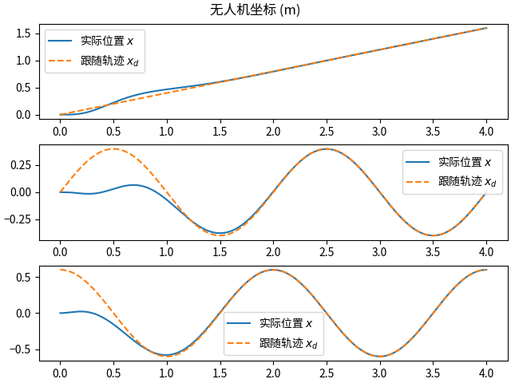
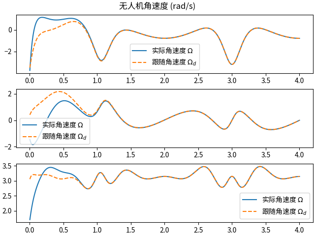

# UAV geometry controller
论文 [Geometric Tracking Control of a Quadrotor UAV on SE(3)](https://ieeexplore.ieee.org/document/5717652) 中几何控制器基于欧拉法的实现与仿真复现

## 主要文件说明
* `__main__.py` 论文中两种示例的复现
* `UAVSimulator.py` 控制器与数值积分仿真相关函数
    * 使用控制器时, 可以去除仿真与结果绘图函数

## 安装方法

基于 pip 安装（用于运行）

```bash
pip install git+https://github.com/tonyddg/uav_geometry_controller.git
# 示例程序说明
python -m uav_geometry_controller -h
```

基于 uv 安装（用于本地开发）

```bash
git clone https://github.com/tonyddg/uav_geometry_controller
cd uav_geometry_controller
uv sync
# 示例程序说明
uv run -m uav_geometry_controller -h
```

## 示例输出




